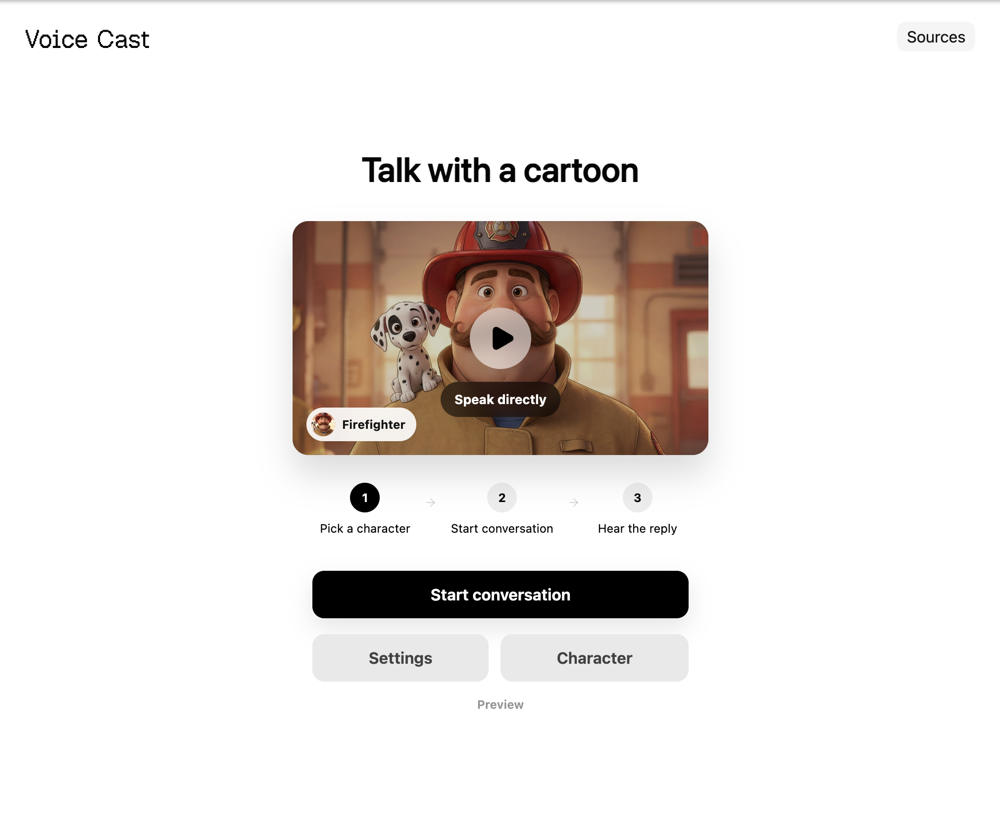

<a href="#voice-cast">
  
  <h1 align="center">Voice Cast</h1>
</a>

<p align="center">
  Local speech-to-speech voice app for talking with cartoon characters.
</p>

<p align="center">
  <a href="#features"><strong>Features</strong></a> ·
  <a href="#runtime"><strong>Runtime</strong></a> ·
  <a href="#models"><strong>Models</strong></a> ·
  <a href="#running-locally"><strong>Running locally</strong></a> ·
  <a href="#demo"><strong>Demo</strong></a>
</p>
<br/>

## Features

- Continuous browser voice chat with barge-in interruption.
- Native Parakeet speech recognition worker with Silero VAD.
- llama.cpp OpenAI-compatible local chat server.
- Supertonic 3 local Russian speech synthesis.
- Single maintained runtime path with no Python service or legacy TTS fallbacks.

## Runtime

```text
browser mic PCM
-> Node WebSocket server
-> Rust Silero VAD + Parakeet ONNX STT
-> llama.cpp OpenAI-compatible chat server
-> Supertonic 3 TTS
-> browser PCM playback
```

## Models

- STT: `models/parakeet-tdt-0.6b-v3-onnx-int8`
- LLM: `models/llm/smollm3-3b/HuggingFaceTB_SmolLM3-3B-Q4_K_M.gguf`
- TTS: `models/supertonic-3`

## Running locally

```bash
bun run dev
```

Open:

```text
http://localhost:3000
```

`bun run dev` starts:

- Vite web app on `127.0.0.1:3000`
- Node voice WebSocket server on `127.0.0.1:8090`
- llama.cpp server on `127.0.0.1:18081`

## Demo

Use this when you want to keep the full voice runtime on your Mac and share a temporary HTTPS URL.

Terminal 1:

```bash
bun run dev
```

Terminal 2:

```bash
bun run demo:tunnel
```

Cloudflare prints a temporary `https://...trycloudflare.com` URL. The browser will use the secure tunnel for microphone access, while STT, LLM, and TTS continue running locally on your machine.

Notes:

- Install `cloudflared` first if needed: `brew install cloudflared`.
- Keep both terminal processes running for the whole demo.
- The current voice server accepts one active client at a time.
- Stop the tunnel with `Ctrl+C` when the demo is finished.

## Commands

| Command | Description |
| --- | --- |
| `bun run dev` | Start the web app, voice server, and llama.cpp server. |
| `bun run dev:web` | Start only the Vite web app. |
| `bun run dev:voice` | Start only the Node voice server. |
| `bun run dev:llm` | Start only the llama.cpp server. |
| `bun run demo:tunnel` | Expose the local Vite app through a temporary Cloudflare Tunnel URL. |
| `bun run check` | Run Biome, TypeScript, Node syntax checks, and tests. |
| `bun run build` | Build the web app. |

## Verification

```bash
bun run check
bun run build
```
